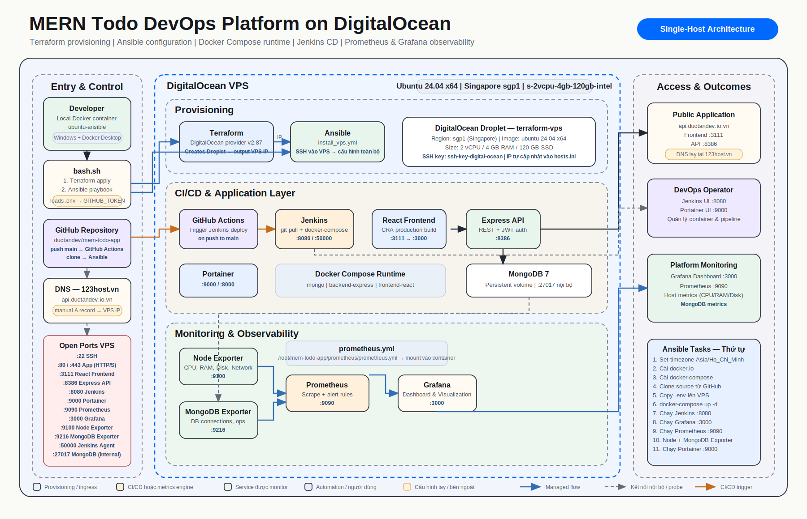

# MERN Todo App — DevOps Pipeline trên DigitalOcean

Triển khai end-to-end một ứng dụng MERN Todo lên VPS DigitalOcean thông qua pipeline tự động hoàn toàn: **Terraform** tạo VPS + cloud firewall, **Ansible** cấu hình server (Docker, UFW, Fail2Ban, SSH hardening) và deploy 4 stack Docker Compose, **GitHub Actions** chạy CI (test + build), **Jenkins** chạy CD, **Prometheus/Grafana/Alertmanager** giám sát và cảnh báo.

## Tổng quan dự án

| Hạng mục | Công nghệ |
|---|---|
| Ứng dụng | React frontend, Express REST API, MongoDB, JWT authentication, Swagger |
| Cloud | DigitalOcean Droplet — Ubuntu 24.04, Singapore (sgp1), 2vCPU/4GB RAM |
| Infrastructure as Code | Terraform + DigitalOcean provider (droplet, cloud firewall, tags) |
| Configuration Management | Ansible (module chuẩn, idempotent, tách tasks/templates) |
| Runtime | Docker Engine + Docker Compose v2 — 4 stack riêng biệt |
| CI | GitHub Actions: install deps → test → build, fail là không deploy |
| CD | Jenkins Pipeline: deploy đúng commit SHA đã pass CI, verify health, cleanup |
| Monitoring | Prometheus + Alert rules + Alertmanager (email), Grafana (dashboard provisioning), Node/MongoDB/Blackbox Exporter |
| Bảo mật host | DO cloud firewall, UFW, Fail2Ban, tắt SSH password login |
| Container Management | Portainer |
| Domain | ductandev.io.vn / api.ductandev.io.vn (DNS quản lý tại 123host.vn, SSL Let's Encrypt qua Nginx Proxy Manager) |

## Kiến trúc



```
Developer ──push──▶ GitHub
                      │
                      ▼
              GitHub Actions (CI)
              ├─ CI Backend:  yarn install → syntax check
              ├─ CI Frontend: npm ci → test → production build
              └─ CI pass ──▶ trigger Jenkins (kèm commit SHA)
                                  │
                                  ▼
                          Jenkins trên VPS (CD)
                          git reset --hard <SHA>
                          docker compose up -d --build
                          verify backend health → cleanup image cũ

Provision lần đầu (bash.sh chạy trong Docker local):
  1. Terraform ──▶ tạo Droplet + Cloud Firewall ──▶ output IP
  2. Ansible   ──▶ SSH vào VPS:
       ├─ base:       timezone, swap 2GB
       ├─ docker:     Docker Engine + Compose v2 (apt, idempotent)
       ├─ security:   UFW + Fail2Ban + tắt SSH password
       ├─ app:        mongo, backend, frontend, nginx-proxy-manager
       ├─ monitoring: prometheus, alertmanager, grafana, exporters
       ├─ ci-cd:      Jenkins (volume persist)
       └─ portainer:  Portainer CE
```

## Cấu trúc thư mục

```
mern-todo-app/
├── terraform/                    # IaC: droplet + firewall + tags
│   ├── provider.tf, variables.tf, main.tf, firewall.tf, outputs.tf
│   └── terraform.tfvars.example  # mẫu — bản thật không commit
├── ansible/
│   ├── install_vps.yml           # Playbook chính (vars + import_tasks)
│   ├── tasks/                    # base, docker, security, source_code,
│   │                             # app, monitoring, ci_cd, portainer, verify
│   ├── templates/alertmanager.yml.j2  # render config chứa SMTP password
│   └── hosts.ini.example         # mẫu inventory — bản thật không commit
├── backend/                      # Express API (Dockerfile non-root, yarn.lock)
├── frontend/                     # React (Dockerfile multi-stage, tự build trong image)
├── monitoring/
│   ├── docker-compose.monitoring.yml
│   ├── prometheus/               # prometheus.yml + alert-rules.yml (đã nối rule_files)
│   ├── grafana/                  # provisioning datasource + dashboard JSON
│   ├── alertmanager/             # config thật do Ansible render, không commit
│   └── blackbox.yml              # HTTP probe frontend + backend
├── ci-cd/docker-compose.ci-cd.yml       # Jenkins + volume jenkins-home
├── portainer/docker-compose.portainer.yml
├── docker-compose.yml            # App stack: mongo, backend, frontend, NPM
├── Jenkinsfile                   # CD: deploy theo SHA + verify + cleanup
├── .github/workflows/main.yml    # CI: test/build → trigger Jenkins
├── bash.sh                       # Pipeline provision toàn bộ
├── .env.example                  # Mẫu biến môi trường — bản thật không commit
└── SECURITY.md
```

## Các service và Port

| Service | Host Port | Container Port | Ghi chú |
|---|---|---|---|
| React Frontend | 5173 | 80 | nginx serve static build |
| Express Backend | 8300 | 8386 | REST API + Swagger |
| MongoDB | 127.0.0.1:27017 | 27017 | chỉ bind localhost, không public |
| Nginx Proxy Manager | 80, 81, 443 | 80, 81, 443 | reverse proxy + SSL |
| Jenkins | 8080, 50000 | 8080, 50000 | CD pipeline |
| Grafana | 3000 | 3000 | dashboard tự provision |
| Prometheus | 9090 | 9090 | metrics + alert rules |
| Alertmanager | 9093 | 9093 | gửi email cảnh báo |
| Node Exporter | — | 9100 | chỉ trong Docker network |
| MongoDB Exporter | — | 9216 | chỉ trong Docker network |
| Blackbox Exporter | — | 9115 | chỉ trong Docker network |
| Portainer | 8000, 9000 | 8000, 9000 | quản lý container |

Cloud firewall (Terraform) chỉ mở các port cần thiết; exporter và MongoDB không mở ra internet.

## Hướng dẫn chạy pipeline

### Yêu cầu

- Docker Desktop đang chạy
- Copy `.env.example` → `.env` và điền giá trị thật (Mongo, JWT, DO token, SMTP...)
- Copy `terraform/terraform.tfvars.example` → `terraform/terraform.tfvars` và điền `do_token`, `ssh_key_fingerprint`
- SSH key DigitalOcean đặt tại `ansible/ssh-key-digital-ocean` (đã gitignore)

### Chạy pipeline tự động

**Bước 1**: Khởi động container Ubuntu:

```powershell
docker run -d -it --name ubuntu-ansible `
  -v C:\path\to\mern-todo-app:/root `
  ubuntu:24.04
```

**Bước 2**: Vào container và chạy script:

```bash
docker exec -it ubuntu-ansible bash -c "cd /root && bash bash.sh"
```

Script sẽ tự động:
1. Terraform tạo VPS + cloud firewall trên DigitalOcean
2. Ghi IP mới vào `ansible/hosts.ini` (file không commit)
3. Chờ SSH sẵn sàng rồi chạy playbook cấu hình toàn bộ VPS

### Chạy Ansible riêng (khi VPS đã có)

```bash
cd ansible
export ANSIBLE_HOST_KEY_CHECKING=False
ansible-playbook -i hosts.ini install_vps.yml
```

Playbook idempotent — chạy lại nhiều lần không gây lỗi hay tạo container trùng.

## CI/CD

**Phân công rõ ràng**: GitHub Actions chịu trách nhiệm **CI** (kiểm thử), Jenkins chịu trách nhiệm **CD** (triển khai). Actions không SSH thẳng vào VPS.

```
push main ──▶ GitHub Actions
              ├─ ci-backend:  yarn install --frozen-lockfile → syntax check
              ├─ ci-frontend: npm ci → npm test → npm run build
              └─ deploy: POST Jenkins buildWithParameters (GIT_COMMIT_SHA)
                            │
                            ▼
                         Jenkins
                         ├─ Deploy:  git reset --hard <SHA> → docker compose up -d --build
                         ├─ Verify:  chờ backend /api/test/buildTest healthy (timeout 2 phút)
                         └─ Cleanup: docker image prune
```

Cấu hình cần thiết:

| Nơi | Key | Giá trị |
|---|---|---|
| GitHub Secrets | `JENKINS_URL` | `http://jen.ductandev.io.vn` hoặc `http://<vps-ip>:8080` |
| GitHub Secrets | `JENKINS_USER` | user Jenkins |
| GitHub Secrets | `JENKINS_TOKEN` | API token của user đó |
| Jenkins Credentials | `SSH_KEY` | SSH private key vào VPS |
| Jenkins Credentials | `VPS_IP` | IP của VPS |

Deploy theo **commit SHA đã pass CI** (không phải HEAD trôi nổi của branch) — build lỗi thì không bao giờ tới được VPS.

## Monitoring & Alerting

- **Prometheus** scrape Node Exporter (CPU/RAM/disk/network), MongoDB Exporter (connections, operations), Blackbox Exporter (HTTP probe frontend + backend health endpoint) — 15s/lần.
- **Alert rules** (`monitoring/prometheus/alert-rules.yml`): exporter down, CPU > 85%, RAM > 90%, disk > 85%, MongoDB không kết nối được, HTTP probe fail.
- **Alertmanager** gửi email qua Gmail SMTP — config do Ansible render từ biến môi trường (`ALERTMANAGER_EMAIL`, `ALERTMANAGER_SMTP_PASSWORD`), không commit password.
- **Grafana** tự provision datasource Prometheus + dashboard host/MongoDB từ JSON — không cần cấu hình tay.

## Bảo mật

Xem chi tiết trong [SECURITY.md](SECURITY.md). Tóm tắt:

- Secrets chỉ nằm trong file không commit (`.env`, `terraform.tfvars`, `hosts.ini`, SSH key) — repo chỉ chứa bản `.example`.
- Repo public → VPS clone qua HTTPS không cần token; `GITHUB_TOKEN`/`DIGITALOCEAN_TOKEN` không bao giờ lên VPS.
- Cloud firewall (Terraform) + UFW + Fail2Ban + tắt SSH password login.
- MongoDB chỉ bind localhost; exporter/credential truyền qua biến môi trường, không hardcode.
- Container backend/frontend chạy non-root; image pin version.

## Kết quả triển khai

| | |
|---|---|
| .png>) | .png>) |
| Droplet do Terraform tạo trên DigitalOcean | GitHub Actions workflow runs |
| .png>) | .png>) |
| Grafana dashboard giám sát MongoDB | Nginx Proxy Manager: proxy hosts + SSL Let's Encrypt |
| .png>) | .png>) |
| Ứng dụng Todo chạy tại ductandev.io.vn | Grafana: storage/collections MongoDB |

## Lưu ý vận hành

- Sau mỗi lần tạo lại VPS, cập nhật DNS A record tại 123host.vn trỏ về IP mới (bash.sh in IP ở cuối).
- Nginx Proxy Manager: tạo proxy host + cert cho `ductandev.io.vn` (5173), `api.ductandev.io.vn` (8300), các subdomain quản trị nếu cần.
- Jenkins lần đầu: lấy initial admin password từ output của Ansible (task `ci_cd`), cài suggested plugins, tạo job `deploy-mern-todo` trỏ vào `Jenkinsfile` của repo, thêm credentials `SSH_KEY` + `VPS_IP`, tạo API token cho GitHub Actions.

## Hướng phát triển tiếp

- Build image trong CI và push lên registry (GHCR/Docker Hub), VPS chỉ pull — tách build khỏi máy production.
- Rollback tự động khi verify fail (giữ tag image trước đó).
- Remote state cho Terraform (Terraform Cloud / S3-compatible) + CI gate `terraform plan`.
- Thêm app metrics cho Express (prom-client) và alert theo error rate.
